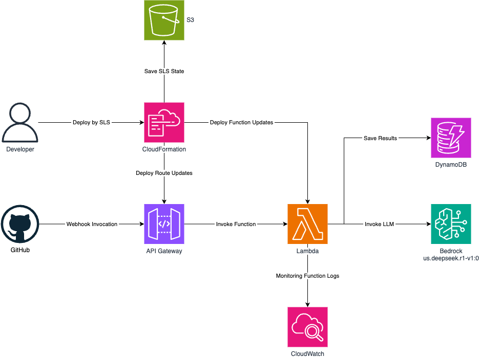

# GitHub IA - Code Validation

This project is a **Serverless application** that leverages **generative AI** to analyze developers' code, providing improvement suggestions based on **Domain-Driven Design (DDD)** and **Clean Code** principles.

## Technologies

- **Serverless Framework**: Used to deploy AWS resources, including **Lambda functions, API Gateway, DynamoDB tables**, and other auxiliary components necessary for the project.
- **Python**: The primary programming language used in this application.
- **DeepSeek AI**: A Large Language Model (LLM) that processes repository changes and suggests code improvements based on DDD and Clean Code practices.

## Project Structure

```
├── layers/                 # Lambda function layers (shared dependencies)
│   ├── common/
│   │   ├── requirements.txt
│   │   └── ...
├── src/                    # Source code for the application
│   ├── functions/          # Lambda functions handling GitHub webhook requests
│   │   ├── __init__.py
│   │   ├── commit_analyzer.py
│   │   ├── functions.yml
│   ├── helpers/            # Utility classes for handling Lambda payloads and responses
│   │   ├── __init__.py
│   │   ├── lambda_payload.py
│   │   ├── lambda_response.py
│   ├── infrastructure/     # YAML files for AWS resource provisioning via Serverless Framework
│   │   ├── __init__.py
│   │   ├── resources.yml
│   ├── services/           # Classes interacting with external services
│   │   ├── __init__.py
│   │   ├── bedrock.py      # AWS Bedrock integration
│   │   ├── dynamodb.py     # DynamoDB interactions
│   │   ├── github.py       # GitHub API interaction
│   ├── __init__.py
├── .env.example            # Example environment configuration file
├── .gitignore              # Git ignore rules
├── deploy-example.sh       # Deployment script
├── README.md               # Project documentation
├── serverless.yml          # Main configuration file for Serverless Framework deployment
```

## Architecture Overview



- **GitHub**: Hosts the repository and triggers webhooks to invoke API Gateway.
- **API Gateway**: Routes webhook requests to AWS Lambda functions.
- **Lambda Functions**: Process commit changes and generate AI-based code improvement suggestions.
- **DynamoDB**: Stores commit metadata and AI-generated suggestions.
- **S3**: Stores Serverless Framework deployment states.
- **CloudWatch**: Monitors Lambda function execution and logs.

## Deployment Instructions

1. **Set up AWS Credentials**: Create an **IAM user** and configure the **Access Key** and **Secret Key** in your local environment.
2. **Update Configuration**: Modify `deploy-example.sh` to include your `ACCOUNT_ID`.
3. **Set up Serverless Framework**: Create an organization in your Serverless Framework account by following the official [Serverless Framework documentation](https://www.serverless.com/framework/docs).
4. **Deploy the Application**: Run the following command:

   ```sh
   sh deploy-example.sh
   ```

## Versioning

| Version | Description     |
| ------- | --------------- |
| 0.1.0   | Initial release |

## Author

**Gustavo Mainchein**  
📧 [gustavomainchein@outlook.com](mailto:gustavomainchein@outlook.com)
